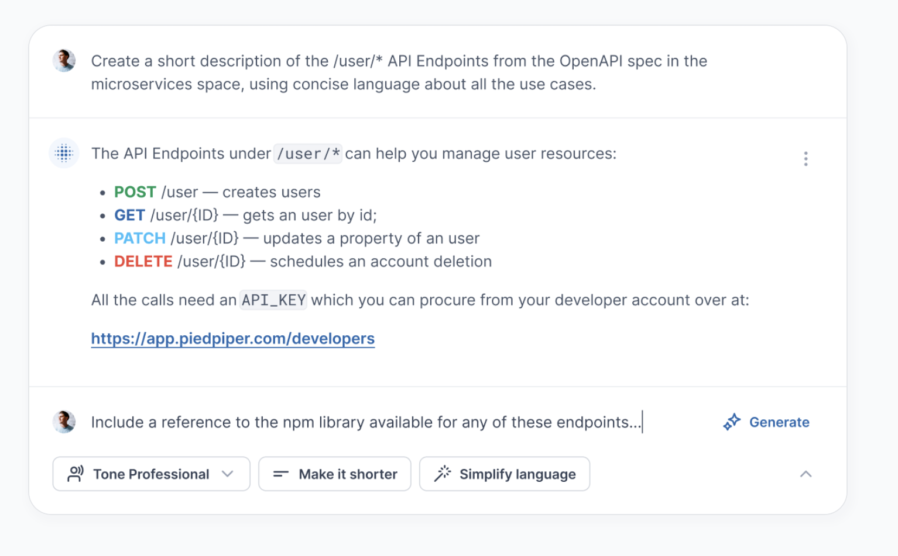

# Images

## Relative

This is a place holder image specified with html

### Markdown syntax

This is a place holder image specified with html

## Html image

### with image tag

This is a place holder image specified with html

### with figure caption

<figure><figcaption>
Retrieve your sandbox API call
</figcaption></figure>

### with picture multi line

<picture>
  
</picture>